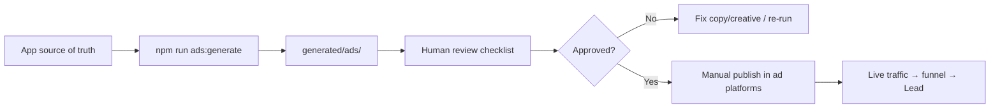

# Ad automation playbook — generate everything, publish manually

This document defines a **fully automated generation + setup pipeline** for Deepchq ads on **Google**, **Instagram (Meta)**, and **Snapchat**. **Spending and “go live” are always manual** — a human completes the verification checklist before any campaign is activated.

**Reference creative:** match the **Deepchq Instagram organic page** and in-app Instagram funnel (`/ads/instagram/step/*`), which mirror the marketing homepage (dark hero, blue accent, social-footprint messaging).

Related: [MARKETING-ADS.md](./MARKETING-ADS.md) (funnel URLs & pixels).

---

## System overview



| Stage | Automated? | Owner |
|-------|------------|--------|
| Copy & campaign structure from app | ✅ Yes | `scripts/ads/generate.ts` |
| Landing URLs + UTMs | ✅ Yes | `automation-spec.ts` |
| Creative briefs & screenshot list | ✅ Yes | `generated/ads/creatives/` |
| Google CSV / Meta & Snap JSON drafts | ✅ Yes | `generated/ads/*/` |
| Creative production (video/image) | ⚠️ Semi | Screen-record funnel or design tool |
| Upload to ad platforms | ⚠️ Optional API | Default: **manual import** |
| Enable spend / set live | ❌ **Manual only** | Verification checklist |

---

## One-time setup

### 1. Config

```bash
cp scripts/ads/config.example.json scripts/ads/config.json
```

Edit `scripts/ads/config.json`:

| Field | Purpose |
|-------|---------|
| `baseUrl` | Production URL (`NEXT_PUBLIC_APP_URL`) |
| `instagramHandle` | Organic IG handle (e.g. `@deepchq`) — **reference for paid creative** |
| `dailyBudgetUsd` | Default daily cap in generated drafts |
| `geoTargets` | e.g. `["US"]` |
| `publishMode` | Always `draft_only` until you add API publish |

### 2. Instagram organic page (reference)

Paid Instagram ads **must align** with:

| Element | Source in repo |
|---------|----------------|
| Dark + blue visual | Homepage `/`, `BRAND_VISUAL` in `src/lib/ads/automation-spec.ts` |
| Headlines | `AD_PLATFORM_CONFIG.instagram` in `src/lib/funnel/platforms.ts` |
| Use-case cards | Homepage `#use-cases` in `src/app/page.tsx` |
| Bio disclaimer | `INSTAGRAM_ORGANIC_REFERENCE.bioLines` |
| Link in bio | `/ads/instagram/step/1` (+ UTMs from generator) |

**Organic content calendar (manual post, automated brief):**

1. **Carousel (4 slides)** — homepage hero → use cases → funnel step 1 → CTA  
2. **Reel (15s)** — screen record `/ads/instagram/step/2` radar  
3. **Stories** — poll → link sticker to funnel step 1  

Hashtags and scripts are in `generated/ads/brand-reference.json` after each run.

### 3. Install generator dependency

```bash
npm install
# tsx is used for the generator script
```

---

## Automated generation (daily / on demand)

```bash
npm run ads:generate
```

**Outputs** (under `generated/ads/`):

| File | Use |
|------|-----|
| `manifest.json` | Full bundle metadata |
| `brand-reference.json` | Colors, IG bio, post templates |
| `google/campaign-draft.json` | Search campaigns (PAUSED) |
| `google/import-sheet.csv` | Google Ads Editor / bulk import |
| `meta/campaign-draft.json` | Meta Ads Manager recreation |
| `snapchat/campaign-draft.json` | Snap Ads Manager recreation |
| `creatives/CREATIVE-BRIEFS.md` | Headlines, bodies, screenshot URLs |
| `review/VERIFICATION-CHECKLIST.md` | **Manual gate before spend** |
| `review/landing-urls.txt` | QA all final URLs |

### Scheduled automation (CI)

GitHub Actions runs weekly (and on manual dispatch):

- Workflow: `.github/workflows/ads-generate.yml`
- Artifact: `generated-ads` zip for download
- Set repo secret `ADS_BASE_URL` = production domain

---

## Platform setup (after generation)

### Google Ads

1. Open `generated/ads/google/import-sheet.csv` or `campaign-draft.json`.  
2. **Tools → Bulk actions → Upload** (or create campaign from JSON fields).  
3. Final URL must match `generated/ads/review/landing-urls.txt` (google row).  
4. Enable **auto-tagging** for `gclid`.  
5. Conversion: **Lead** (step 3) + **Purchase** (Stripe).  
6. Leave campaign **Paused** until checklist signed.

### Instagram / Meta

1. Open `generated/ads/meta/campaign-draft.json`.  
2. Create campaign → objective **Leads** → placement **Instagram** (Reels, Stories, Feed).  
3. Paste **primary text / headline** from JSON `ads[]` entries.  
4. Upload video from brief (`/ads/instagram/step/2` recording) or carousel cards from step copy.  
5. Website URL = generated `finalUrl`.  
6. Pixel: PageView + Lead.  
7. **Compare side-by-side with organic IG profile** before approve.

### Snapchat

1. Open `generated/ads/snapchat/campaign-draft.json`.  
2. Objective **Lead Generation** · 9:16 creative from step copy.  
3. Web view URL from `landing-urls.txt` (snapchat row).  
4. Snap Pixel: PAGE_VIEW, LEAD.

---

## Manual verification gate (required)

Open **`generated/ads/review/VERIFICATION-CHECKLIST.md`** after every generate run.

Sign off each campaign:

- [ ] Landing page loads on mobile (IG/Snap) and desktop (Google)  
- [ ] UTM + click IDs captured (`funnel_session` in DB)  
- [ ] Copy matches Instagram organic + funnel (no private/hack claims)  
- [ ] FCRA disclaimer present (funnel footer + ad text)  
- [ ] Budget and geo correct  
- [ ] Campaign still **Paused** until named approver enables  

**Only after all boxes:** set campaign to **Active** in the ad platform UI.

---

## Optional: API upload (still PAUSED)

Future phase — credentials in env, never auto-activate:

| Platform | Env vars | Behavior |
|----------|----------|----------|
| Meta | `META_ACCESS_TOKEN`, `META_AD_ACCOUNT_ID` | Create campaign/ad set/ad as `PAUSED` |
| Google | `GOOGLE_ADS_*` | Upload via Google Ads API, `status: PAUSED` |
| Snap | `SNAP_ADS_*` | Draft ads only |

`publishMode: "paused_upload"` in config — implement in `scripts/ads/upload.ts` when tokens are ready. **Go-live remains manual.**

---

## Regenerating when the app changes

Whenever you update:

- `src/lib/funnel/platforms.ts` (funnel copy)  
- `src/app/page.tsx` (homepage / use cases)  
- `src/lib/brand.ts`  

Run:

```bash
npm run ads:generate
git add generated/ads && git commit -m "chore: refresh ad drafts"
```

Review the diff in `manifest.json` and re-run the verification checklist before next spend.

---

## Troubleshooting

| Issue | Fix |
|-------|-----|
| Wrong domain in URLs | Set `baseUrl` in `scripts/ads/config.json` |
| IG ads don’t match feed | Re-read `brand-reference.json` + organic post templates |
| Generator fails | `npm install` and use Node 20+ with `npx tsx` |
| Empty review queue | Check `automation-spec.ts` campaign builders |

---

## Quick reference commands

```bash
cp scripts/ads/config.example.json scripts/ads/config.json
npm run ads:generate
open generated/ads/review/VERIFICATION-CHECKLIST.md
```

**Rule:** Generation and setup = automated. **Running ads = manual verification only.**
